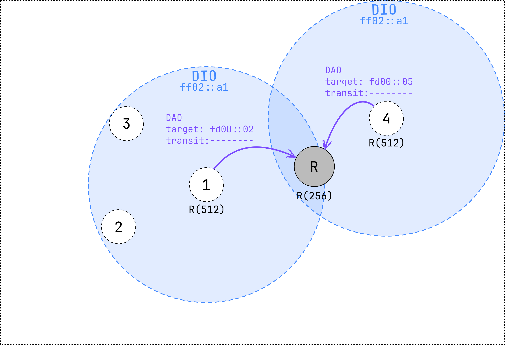

# MOP2: storing mode without multicast

In this mode of operation, the network is formed like non-storing mode, but the *DAO* messages are sent to the preferred parent.
Each node stores a routing table containing information on how to reach all their descendants (all the nodes in their subtree).
A node receiving a *DAO* transmits a new *DAO* message to its own preffered parent.
The route information is propagated upwards until it reaches the root.

Since the *DAO* messages are sent in one hop, the transit information option,
usually used to indicate the parent of the node, is left empty.
Instead, the destination address of the *DAO* message is used as the address of the preferred parent.


<small>
Figure 1: node 1 and 4 send a *DAO* message to the root after joining the network.
The transit information option is left empty.
</small>

Nodes can now send data packets to any other node in the network, since they have a downward route to all their descendants.
When a node receives a packet, it first checks if it has a downward route to the destination of the packet.
A packet first goes to a common ancestor of the sender and receiver, and then it is forwarded downwards to the receiver.

```admonish example
Node 2 transmits a packet to node 3 (imagine that node 3 is not in range of node 2).
1. The packet is first transmitted to the preferred parent of node 2 (node 1),
   since node 2 does not have a downward route to node 3.
2. Node 1 forwards the packet to node 3, since it has a downward route to node 3.


```

## Usage with smoltcp ##

The RPL network can be formed using the `smoltcp` library.
The following feature flags need to be enabled: `rpl-mop-2` and `proto-sixlowpan`.
Additionally, the `proto-sixlowpan-fragmentation` feature can be enabled to allow for fragmentation of 6LoWPAN packets.

The following configuration should be added to the configuration struct for the interface:
```rust
config.rpl = RplConfig::new(RplModeOfOperation::StoringMode);
```

When using RPL as a root node, the following configuration should be added:
```rust
config.rpl = RplConfig::new(RplModeOfOperation::StoringMode)
    .add_root_config(RplRootConfig::new(
        RplInstanceId::from(30), // Change this to the desired RPL Instance ID
        Ipv6Address::default(),  // Change this to the desired DODAG ID
    ));
```

The interface should now behave like a RPL node in MOP2.

# Summary #

- Every node in the network has an overview of the network topology.
- Packets travel via a common ancestor of the sender and receiver.
