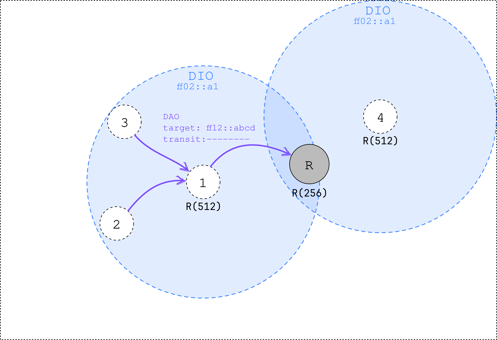
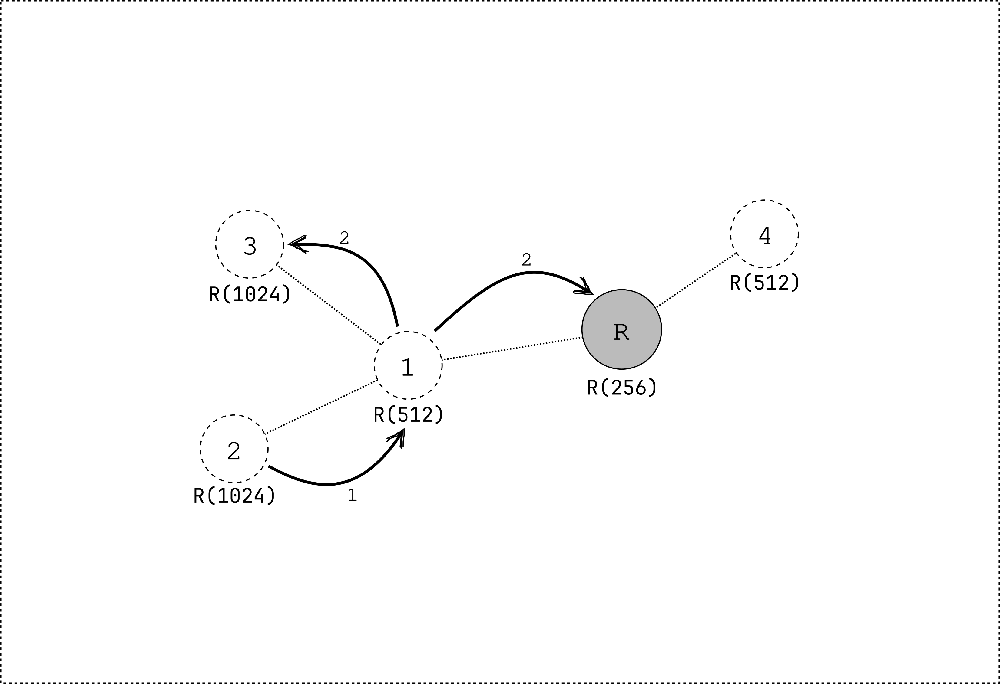

# MOP3: storing mode with multicast

Mode of Operation 3 (MOP3) extends MOP2 by adding support for multicast.
In MOP3, the network is formed like in MOP2, but an extra _DAO_ message is transmitted.
This _DAO_ message contains a multicast group address that the node wants to join.
The node transmits the _DAO_ message to its preferred parent.

The _DAO_ message is propagated upwards until it reaches the root.
Every node that receives the _DAO_ message keeps track of which children are part of the multicast group 
(adding this information in the routing table).
When a node receives a multicast packet, it forwards the packet to all children that are part of the multicast group
(except the originator of the packet).
On link-layer level, the frames are sent using unicast addresses.
This means that every packet is duplicated for every child that is part of the multicast group.
To avoid duplication, other mechanisms can be used.
However, these are not part of the RPL standard.

- Multicast Protocol for Low-Power and Lossy Networks (MPL/TM)
- (Enhanced) Sateless Multicast RPL Forwarding (ESMRF/SMRF)
- Proactive Multicast RPL Forwarding (PMRF)
- Bidirectional Multicast RPL Forwarding (BMRF)


<small>
Figure 1: node 2 and 3 subscribe to the `FF12::ABCD` multicast group by sending a _DAO_ message to their preferred parent.
The transit information option is left empty.
Even though node 1 is not interested in the multicast group,
it has to transmit a _DAO_ message to its preferred parent.
It has to subscribe to the multicast group to be able to forward multicast packets to its children.
</small>

```admonish example title="Node 2 transmits a packet to the multicast group"

1. The packet is first transmitted to the preferred parent of node 2.
   Node 2 does not have a downward route to the multicast group.
2. Node 1 duplicates the packet to all children that are part of the multicast group (except for the originator).
   It also forwards the packet to its preferred parent, the root.

The root only has 1 child subscribed to the multicast group (node 1).
However, it does not forward the packet to node 1, since it is the originator of just received packet.


```

```admonish danger title="Unsubscribing from a multicast group"
The RPL standard does not specify how to unsubscribe from a multicast group.
```

## Usage with smoltcp ##

The RPL network can be formed using the `smoltcp` library.
The following feature flags need to be enabled: `rpl-mop-2` and `proto-sixlowpan`.
Additionally, the `proto-sixlowpan-fragmentation` feature can be enabled to allow for fragmentation of 6LoWPAN packets.

The following configuration should be added to the configuration struct for the interface:
```rust
config.rpl = RplConfig::new(RplModeOfOperation::StoringMode);
```

When using RPL as a root node, the following configuration should be added:
```rust
config.rpl = RplConfig::new(RplModeOfOperation::StoringMode)
    .add_root_config(RplRootConfig::new(
        RplInstanceId::from(30), // Change this to the desired RPL Instance ID
        Ipv6Address::default(),  // Change this to the desired DODAG ID
    ));
```

The interface should join a multicast group:
```rust
interface.join_multicast_group(
    device,
    // Change this to the desired multicast group address
    Ipv6Address::new_multicast("FF12::ABCD"),
    Instant::now()
);
```

The interface should now behave like a RPL node in MOP3.

## Summary

- An extra _DAO_ message is sent to join a multicast group.
- Packets are forwarded to all children that are part of the multicast group, duplicating packets, except for the originator.
  The packet is also forwarded to the preferred parent.
